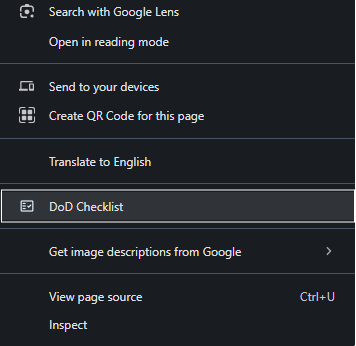
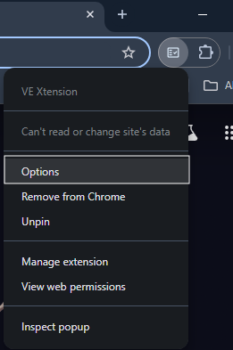

# VE Xtension
A browser extension that enhances the [OpenText](https://www.opentext.com/) ValueEdge platform with additional features.

## Features
- Displays relevant Definition of Done (DoD) checkList based on the currently opened ticket and its status.

- Reminds users to review and complete DoD checkList when changing ticket phases.

- Allows users to add completed DoD checkList in comments to track and maintain a record of the completion status for each DoD item.

- Currently available exclusively for Google Chrome. Plans for support of additional browsers in future releases

## How to Use the Extension
* Open a ValueEdge ticket in your browser.
* Right-click anywhere on the page.
* In the context menu, you will see an option called "DoD Checklist".


> Click on "DoD Checklist" to open a pop-up displaying the Done Checklist for the ticket.


> Example DoD CheckList
## How to Upload Definition of Done (DoD) File:


> Right-click the extension icon in your browser's toolbar, then select 'Options' from the menu. This will open the options page, where you can upload a new DoD file (If you encounter issues, please ensure the file is not empty and follows the below mentioned schema)

## Ticket Entity Schema 
```json
{
  "<entityName>": {
    "type": "object",
    "properties": {
      "title": {
        "type": "string",
        "description": "The title representing the type of ticket (e.g., Defect, Epic)"
      },
      "categories": {
        "type": "array",
        "items": {
          "type": "object",
          "properties": {
            "name": {
              "type": "string",
              "description": "The name of the category."
            },
            "checkList": {
              "type": "array",
              "items": {
                "type": "string",
                "description": "An individual checklist item."
              }
            }
          }
        }
      }
    }
  }
}
```
**Supported Entity Types:** ```"Epic","Feature","Defect","Enhancement","CPE Incident","User Story","Internal","Spike","Quality Story","Task"```

## Example DoD Json

```JSON
{
"Defect": {
    "title": "Defect",
    "categories": [
      {
        "name": "Investigation",
        "checkList": [
          "Reproduce the issue",
          "Gather logs and screenshots",
          "Determine root cause",
          "Document findings"
        ]
      },
      {
        "name": "Resolution",
        "checkList": [
          "Implement fix",
          "Run regression tests",
          "Confirm issue resolution",
          "Close defect after verification"
        ]
      }
    ]
},
"Spike": {
    "title": "Spike",
    "categories": [
      {
        "name": "Exploration",
        "checkList": [
          "Identify technical questions",
          "Review relevant documentation",
          "Build simple prototype",
          "Evaluate technical feasibility"
        ]
      },
      {
        "name": "Conclusion",
        "checkList": [
          "Summarize findings",
          "Present results to the team",
          "Document next steps",
          "Archive research notes"
        ]
      }
    ]
  }
}
```
#### Please note that the schema is case-sensitive. Ensure that all keys and values match the required casing exactly.


