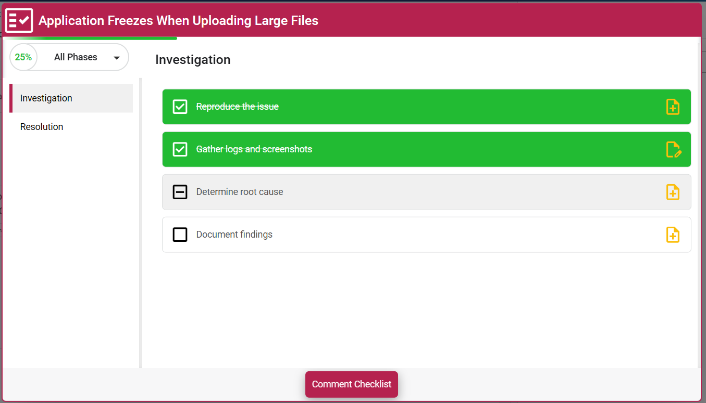
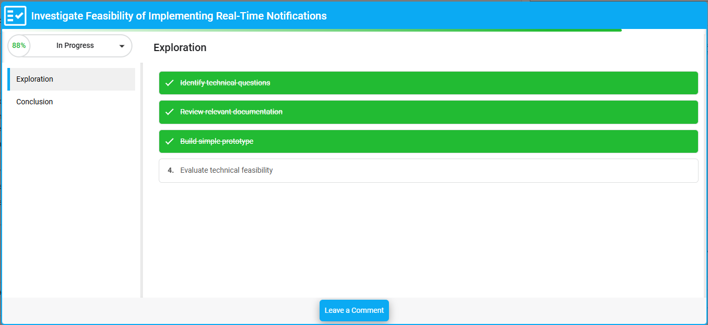
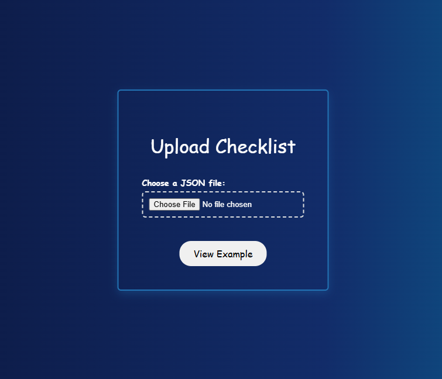

<div align="center">
     <h1>VE Checklist</h1>
    <p>Checklist Tool for OpenText ValueEdge platform.</p>
     
    <div align="center">
        
        
    </div>
</div>


## Features 🚀
- Displays relevant Definition of Done (DoD) & Definition of Ready (DOR) Checklist based on the currently opened ticket and its status.
- Reminds users to review and complete Checklist when changing ticket phases.
- Users can create their own customized Checklist based on their project requirements.
- Allows users to add completed Checklist in comments to track and maintain a record of the completion status for each item.

## How to 💡
**Use the Extension?**
* Open a ValueEdge ticket in your browser.
* Right-click anywhere on the page.
* In the context menu, you will see an option called "DoD Checklist".
* Click on it to open a pop-up displaying the Done Checklist for the ticket.


<div align="center" style="text-align: center;">
    
    
</div>


**Upload Checklist?**

Right-click the extension icon in your browser's toolbar, then select 'Options' from the menu. This will open the options page, where you can upload a new DoD file (If you encounter issues, please ensure the file is not empty and follows the below mentioned schema)
<div align="center" style="text-align: center;">
    
</div>

#### Example Checklist

```json
{
  "Defect": {
    "categories": {
      "Reproduction": {
        "checklist": [
          "Steps to reproduce the issue are clearly documented",
          "Actual vs expected behavior is described",
          "Screenshots or logs are attached, if applicable"
        ],
        "phases": ["New", "Inprogress"]
      },
      "Resolution": {
        "checklist": [
          "Root cause analysis is documented",
          "Solution has been tested and verified",
          "All relevant stakeholders are informed of the fix",
          "Test cases are updated to cover the issue"
        ],
        "phases": ["Done", "Resolved"]
      }
    }
  },
  "Spike": {
    "categories": {
      "Planning": {
        "checklist": [
          "Objective of the spike is clearly defined",
          "Expected deliverables are documented",
          "Team has agreed on a timebox for the spike"
        ],
        "phases": ["New", "Inprogress"]
      },
      "Analysis": {
        "checklist": [
          "Relevant research and findings are documented",
          "Any discovered blockers or risks are noted",
          "Recommendations or next steps are provided"
        ],
        "phases": ["Done", "Resolved"]
      }
    }
  }
}
```
**Please note ⚠️**
- The schema is case-sensitive. Ensure that all keys and values match the required casing exactly.
- Whenever you refresh this extension, please do refresh the currently opened ValueEdge pages
