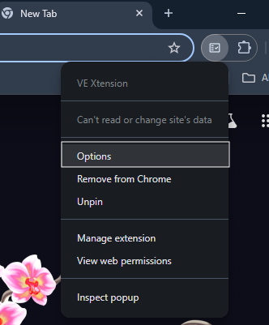

# VE Xtension
A browser extension that enhances the OpenText ValueEdge platform with additional features for teams.

## Features
- Displays relevant DoD items based on the currently opened ticket and its status.

- Reminds users to review and complete DoD items when changing ticket phases.

- Allows users to add completed DoD items in comments to track and maintain a record of the completion status for each DoD item.

- Currently available exclusively for Google Chrome. Plans for support of additional browsers in future releases

## How to Upload a DoD File
Right-click the extension icon in your browser's toolbar, then select 'Options' from the menu. This will open the options page, where you can upload a new DoD file (must be in JSON format).

