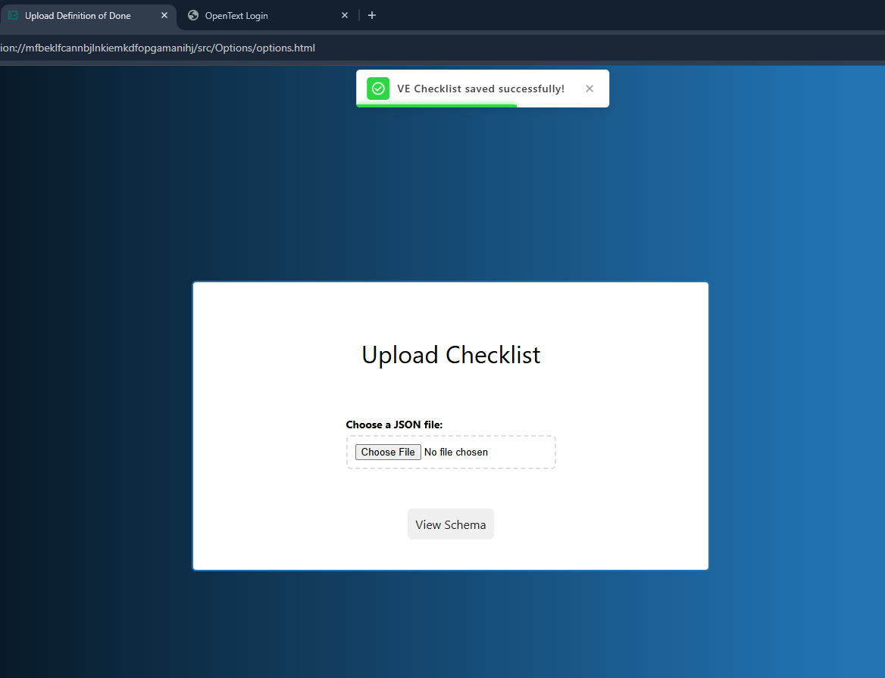

# VE Checklist
Checklist Tool for [OpenText](https://www.opentext.com/) ValueEdge platform.

## Features
- Displays relevant Definition of Done (DoD) & Definition of Ready (DOR) checkList based on the currently opened ticket and its status.
- Reminds users to review and complete checkList when changing ticket phases.
- Users can create their own customized checklists based on their project requirements.
- Allows users to add completed checkList in comments to track and maintain a record of the completion status for each item.

## How to ?
**Use the Extension**
* Open a ValueEdge ticket in your browser.
* Right-click anywhere on the page.
* In the context menu, you will see an option called "DoD Checklists".
* Click on it to open a pop-up displaying the Done Checklist for the ticket.


> DoD CheckList
**Upload Checklist**:

Right-click the extension icon in your browser's toolbar, then select 'Options' from the menu. This will open the options page, where you can upload a new DoD file (If you encounter issues, please ensure the file is not empty and follows the below mentioned schema)

> Upload CheckList

## Ticket Entity Schema 
```json
{
  "<entityName>": {
    "type": "object",
    "properties": {
      "title": {
        "type": "string",
        "description": "The title representing the type of ticket (e.g., Defect, Epic)"
      },
      "categories": {
        "type": "array",
        "items": {
          "type": "object",
          "properties": {
            "name": {
              "type": "string",
              "description": "The name of the category."
            },
            "checklist": {
              "type": "array",
              "items": {
                "type": "string",
                "description": "An individual checklist item."
              }
            }
          }
        }
      }
    }
  }
}
```
**Supported Entity Types:** ```"Epic","Feature","Defect","Enhancement","CPE Incident","User Story","Internal","Spike","Quality Story","Task"```

## Example JSON File

```JSON
{
"Defect": {
    "title": "Defect",
    "categories": [
      {
        "name": "Investigation",
        "checklist": [
          "Reproduce the issue",
          "Gather logs and screenshots",
          "Determine root cause",
          "Document findings"
        ]
      },
      {
        "name": "Resolution",
        "checklist": [
          "Implement fix",
          "Run regression tests",
          "Confirm issue resolution",
          "Close defect after verification"
        ]
      }
    ]
},
"Spike": {
    "title": "Spike",
    "categories": [
      {
        "name": "Exploration",
        "checklist": [
          "Identify technical questions",
          "Review relevant documentation",
          "Build simple prototype",
          "Evaluate technical feasibility"
        ]
      },
      {
        "name": "Conclusion",
        "checklist": [
          "Summarize findings",
          "Present results to the team",
          "Document next steps",
          "Archive research notes"
        ]
      }
    ]
  }
}
```

## Contributing
We welcome contributions from everyone! Here's how you can get involved:

- **Report Issues**: Encounter a bug? Have a feature request? Open an issue on our GitHub repository to let us know.
- **Contribute Code**: Want to dive into the codebase? Check out our open issues and pull requests.Fork the repository, make your changes, and submit a pull request.
- **Suggest Improvements**: Have ideas for new features or enhancements? Share them in a new issue. Discuss potential improvements with the community.
- **Enhance Documentation**: Improve our documentation by fixing errors, adding clarity, or creating new guides. Submit a pull request to our documentation repository.
- **Share Sample Checklists**: Contribute sample checklists to our repository to help others.

### Please note:
- The schema is case-sensitive. Ensure that all keys and values match the required casing exactly.
- Whenever you refresh this extension, please do refresh the currently opened ValueEdge pages
